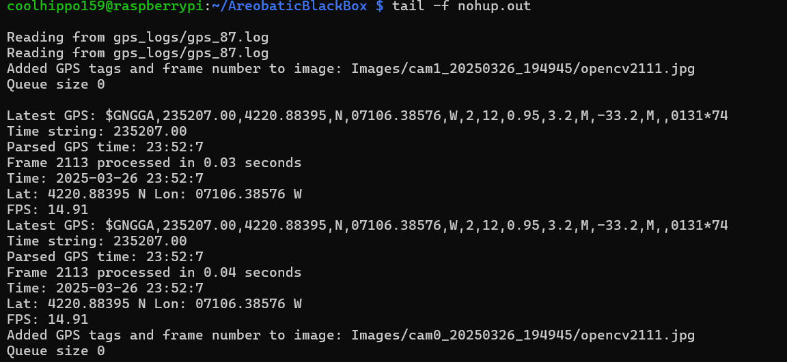

# Instructions

There are two main components to start. After clonining the repo, make sure you run the commands from the top directory of the repo. The name of the folder is AreobaticBlackBox.

For the connection between the GPS and the Pixhawk, connect the 
Red is 5V, Black is GND, Blue is TX and Yellow is RX.

Connect the GPS to the raspberry PI wil the microUSB cable. Connect the raspberry PI to the Pixhawk with the microUSB cable.

Make sure you are on a network other than eduroam, and remotely access the raspberry PI. You can also use an ethernet cable. 
```
ssh coolhippo159@hostname
```
To connect over wifi. Run `ifconfig wlan0` to find the IP address on the wifi network and replace the hostname with the IP address in the above command to connect to it wirelessly. The command `dmesg` is also useful for seeing the GPS and Pixhawk are connected to the raspberry PI.

Start all of the processes with:
```
nohup python3 run_all.py ; python3 run_all.py & 

```

Make sure the process is running by going to the gps_logs folder and opening the log with the largest number. Additionally, go the mav_logs folder and make sure the tlog size is increasing by running ls -lh multiple times. Lastly, go the the Images folder and check that the folder with the latest date and time is filling up with images. Use `ls -lh` in the Images folder to check the sizes of the folders.

You can also monitor the output log with 
```
tail -f nohup.out
```
<p align="center">

</p>
<p align="center">
Nominal nohup output log
</p>

You can also open up mission planner on your computer and connect over UDP with the default port of 14550. Make sure that your computer is the one that ran `run_all.py` or else it won't forward the information to the right computer.


## Cameras
The python script run_all.py starts two UVC cameras and records the output in the Images folder. They are both recording at 1920x1080 and around 20 fps. The script increments the foldername for every new recording. The fps, time, and gps coordinates are written the the frame.

## Pixhawk and GPS

The mavproxy program is responsible for handling the pixhawk. I followed https://ardupilot.org/mavproxy/docs/getting_started/download_and_installation.html to install it.

Start mavproxy with:

```
nohup mavproxy.py --non-interactive --baudrate=912000 > mavproxy.log & 
```

Listen to the GPS to Raspberry Pi

```
nohup cat /dev/ttyACM1 > gps.log &
```

The run_all.py starts these commands automatically.

We referenced this guide https://oscarliang.com/gps-settings-u-center/ on configuring the GPS.
The Pixhawk logs are saved in D:\APM\LOGS in the pixhawk sd card. The file cubeblack.param contains the parameters for the Pixhawk.


## Reviewing data

Grab the latest .BIN file from the pixhawk and extract a .mat file through mission planner.